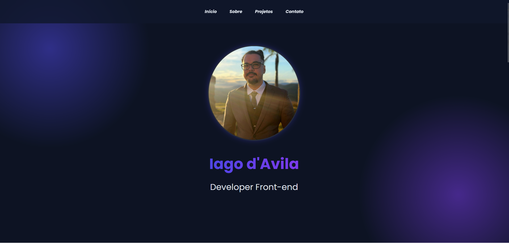

👨‍💻 Iago Davila — Front-End Developer

Bem-vindo ao meu portfólio de desenvolvimento front-end.
Aqui apresento projetos desenvolvidos durante meus estudos e práticas com foco em interfaces modernas, responsivas e experiência visual de alta qualidade.

🌐 Preview do Portfólio

  

🔗 Acesse o site:
https://iagodavila.github.io/Portfolio/

## 🚀 Tecnologias Utilizadas

O portfólio foi desenvolvido utilizando as seguintes tecnologias:

📂 Projetos
🛍️ E-commerce de Roupas

Interface de e-commerce responsiva desenvolvida com HTML, CSS e JavaScript.

Principais características

Layout moderno

Navegação entre páginas

Organização de produtos com Flexbox e Grid

Estrutura responsiva

🎧 DevStore Slider

Componente de slider interativo desenvolvido para exibir produtos ou banners em destaque.

Tecnologias utilizadas:

Funcionalidades:

Navegação entre slides

Transições suaves

Estrutura reutilizável

📱 iPhone 17 Landing Page

Clone moderno da página do iPhone 17 Pro, inspirado no design minimalista da Apple.

Tecnologias:

Objetivo do projeto

Praticar componentização com React

Criar layouts responsivos

Reproduzir interfaces modernas

Aplicar boas práticas de front-end

📬 Contato

💻 GitHub
https://github.com/IagodAvila

💼 LinkedIn
https://www.linkedin.com/in/iago-d-avila-851399332/

⭐ Obrigado por visitar meu portfólio!
